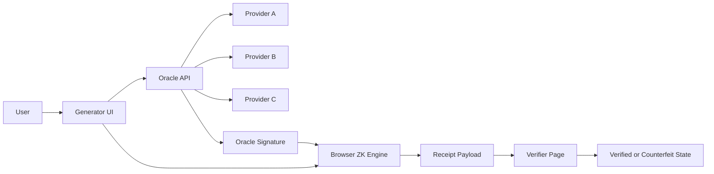
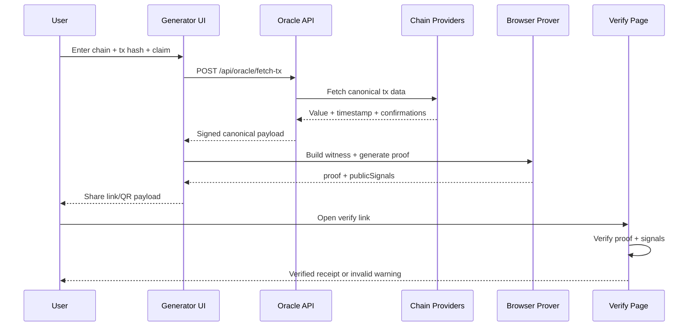

<!-- donation:eth:start -->
<div align="center">

## Support Development

If this project helps your work, support ongoing maintenance and new features.

**ETH Donation Wallet**  
`0x11282eE5726B3370c8B480e321b3B2aA13686582`

<a href="https://etherscan.io/address/0x11282eE5726B3370c8B480e321b3B2aA13686582">
  
</a>

_Scan the QR code or copy the wallet address above._

</div>
<!-- donation:eth:end -->


<div align="center">


**Generate cryptographic payment receipts without exposing sensitive on-chain identity data.**

### _"Prove the payment. Keep the privacy."_

[Roadmap](./docs/project/ROADMAP.md) | [Plan](./docs/project/PLAN.md) | [Report Bug](https://github.com/teycir/GhostReceipt/issues)

</div>

---

## Table of Contents
- [Overview](#overview)
- [Why GhostReceipt](#why-ghostreceipt)
- [Key Features](#key-features)
- [Use Cases](#use-cases)
- [Architecture](#architecture)
- [API Model](#api-model)
- [Logic Flow](#logic-flow)
- [Tech Stack](#tech-stack)
- [Quick Start](#quick-start)
- [Configuration](#configuration)
- [FAQ](#faq)
- [References](#references)
- [Contact](#contact)

## Overview
GhostReceipt is a privacy-first app that lets users prove payment facts (amount and time window) with zero-knowledge proofs while redacting sender, receiver, and tx hash from shared receipts.

Core product goals:
- Zero-friction UX: from tx hash to shareable proof in under 60 seconds
- No forced signup
- No forced API key from users
- No credit card requirement for local dev and default flow

## Why GhostReceipt
Most payment proof flows force one of two bad options:
- Share too much on-chain identity and lose privacy
- Ask users to trust screenshots or opaque claims

GhostReceipt solves this by combining:
- Verifiable oracle-signed canonical tx facts
- Browser-side zk proof generation
- Shareable verification payloads with redacted sensitive data

## Key Features
- Multi-provider tx fetch with automatic cascade failover
- Optional BYOK (advanced), never required for core user flow
- Deterministic proof generation and verification pipeline
- Shareable receipt links + QR export
- Mobile-first UX with progressive disclosure
- Static docs pages linked from footer (`how-to-use`, `faq`, `security`, `canary`, `license`)

## Use Cases
- Freelancers proving milestone payments without revealing wallet graph
- Merchants proving payment completion without exposing customer addresses
- Accounting and compliance teams validating payment evidence safely
- P2P market participants resolving disputes with verifiable receipts
- DAO contributors proving payouts while minimizing on-chain identity leakage

## Architecture


## API Model
GhostReceipt uses four API types so the product stays reliable while keeping UX friction near zero:

1. Public no-key data APIs (default path):
- BTC reads from `mempool.space` first.
- ETH reads from public RPC endpoints via `viem`.
- Used first to keep onboarding keyless and no-card friendly.

2. Managed keyed provider APIs (server-side fallback path):
- For ETH, keyed fallback uses only Etherscan keys provided by project maintainers.
- Current ETH managed key pool is the internal Etherscan set (primary + fallback keys) configured via server env vars.
- Keys are platform-managed in server environment variables and never exposed in client code.
- Multiple managed keys are rotated through a cascade manager for resilience (same pattern as smartcontractpatternfinder).

3. First-party internal Oracle API:
- `POST /api/oracle/fetch-tx` validates input, fetches canonical tx facts, normalizes data, and returns an oracle-signed payload.
- This API is the trust boundary between provider variance and deterministic proof generation.

4. Optional BYOK APIs (advanced mode only):
- Users may add their own provider keys for higher throughput.
- BYOK is optional and never required for receipt generation or verification.
- For non-ETH providers, GhostReceipt uses the same cascade/failover system now and can attach managed keys later as they are provided.

## Logic Flow


## Tech Stack
- Frontend:
- Next.js (App Router), React, TypeScript
- Tailwind CSS + reusable UI components
- TanStack Query + React Hook Form + Zod
- Backend/Edge:
- Cloudflare Workers (optional deploy target)
- Node/Next API fallback for local-first no-card mode
- ZK:
- Circom 2 + snarkjs
- Data:
- BTC: mempool.space primary, Blockchair fallback
- ETH: public RPC (viem) primary, Etherscan fallback via managed server-side key pool (Etherscan-only keyed source)
- Reliability:
- Provider/key cascade manager with immediate failover and bounded concurrency (smartcontractpatternfinder-style)

## Quick Start

### Prerequisites

- Node.js 20.9.0 or higher
- npm 9.0.0 or higher

```bash
node --version  # Should be >= 20.9.0
npm --version   # Should be >= 9.0.0
```

### Installation

```bash
# 1) Clone
git clone https://github.com/teycir/GhostReceipt.git
cd GhostReceipt

# 2) Install
npm install

# 3) Configure
cp .env.example .env.local

# 4) Run
npm run dev
```

Open `http://localhost:3000`.

## Configuration
- No-credit-card mode: default local setup must work with free/public providers.
- No-user-API-key mode: users are not required to bring API keys.
- Optional BYOK: power users can add keys for higher throughput, but core UX remains keyless.
- Server-managed keys: sensitive provider keys live only in `.env.local`/deployment secrets and must never be committed.
- ETH managed keyed fallback is Etherscan-only for now; other provider keys will be added later without changing the UX contract.

## Documentation
- Documentation hub: [docs/README.md](./docs/README.md)
- Product plan: [docs/project/PLAN.md](./docs/project/PLAN.md)
- Execution roadmap: [docs/project/ROADMAP.md](./docs/project/ROADMAP.md)
- Progress tracking: [docs/project/IMPLEMENTATION_PROGRESS.md](./docs/project/IMPLEMENTATION_PROGRESS.md)
- Security runbook: [docs/runbooks/SECURITY.md](./docs/runbooks/SECURITY.md)

## FAQ
### Is GhostReceipt custodial?
No. Proof generation and sensitive witness data stay in the client-side flow.

### Do users need to connect a wallet?
No for the base flow. Users only provide tx hash and claim parameters.

### Do users need API keys?
No. API key entry is optional advanced mode only.

### Can this run without a credit card?
Yes. Local setup and baseline flow are designed for no-card operation.

### What does the verifier see?
Only proof-related public claims and redacted receipt output, not raw sensitive identities.

### Is Monero supported?
Planned as a dedicated track with separate constraints due to hidden amounts.

## Complementary Projects

GhostReceipt is part of a privacy-first toolkit. Check out these related projects:

### [GhostChat](https://github.com/Teycir/GhostChat) | [Live Demo](https://ghost-chat.pages.dev)
**True peer-to-peer encrypted messaging with zero server storage**
- WebRTC-based P2P chat where messages travel directly between users
- Self-destructing messages (5s, 30s, 1m, 5m timers)
- Memory-only storage with no disk traces
- Connection fingerprint verification to detect MITM attacks
- Perfect for: Sharing payment receipt links securely without leaving traces

**Use with GhostReceipt**: Share your generated receipt links via GhostChat to ensure the communication channel itself is private and ephemeral.

### [TimeSeal](https://github.com/Teycir/Timeseal) | [Live Demo](https://timeseal.online)
**Cryptographic time-locked vault and dead man's switch**
- Send encrypted messages/files that unlock at a specific future date
- Dead man's switch mode: auto-unlock if you stop checking in
- Split-key architecture with server-enforced time locks
- 30-day retention with grace period for recovery
- Perfect for: Time-delayed payment proof disclosure or conditional receipt sharing

**Use with GhostReceipt**: Seal a payment receipt that only unlocks after a milestone date, or set up a dead man's switch to auto-release payment evidence if you go silent.

### [Sanctum](https://github.com/Teycir/Sanctum) | [Live Demo](https://sanctumvault.online)
**Zero-trust encrypted vault with plausible deniability**
- Duress-proof hidden layers (decoy/hidden/panic passphrases)
- XChaCha20-Poly1305 encryption with IPFS storage
- RAM-only key storage immune to forensic recovery
- Perfect for: Storing sensitive payment receipts with cryptographic deniability under coercion

**Use with GhostReceipt**: Store your generated receipt links and verification keys in Sanctum's hidden layer, protected by plausible deniability if device is seized.

### [HoneypotScan](https://github.com/Teycir/honeypotscan)
**Smart contract honeypot detector for DeFi safety**
- Detects scam tokens that prevent selling after purchase
- 13 specialized patterns across Ethereum, Polygon, Arbitrum
- 98% sensitivity with 95%+ cache hit rate
- Perfect for: Verifying token legitimacy before generating payment receipts for crypto transactions

**Use with GhostReceipt**: Before proving payment for a token purchase, verify the token isn't a honeypot scam that would make your receipt meaningless.

---

## References
- Product plan: [docs/project/PLAN.md](./docs/project/PLAN.md)
- Execution checklist: [docs/project/ROADMAP.md](./docs/project/ROADMAP.md)
- Reference source: `/home/teycir/Repos/xmrproof`
- Reference source: `/home/teycir/Repos/Timeseal`
- Reference source: `/home/teycir/Repos/Sanctum`
- Reference source: `/home/teycir/Repos/smartcontractpatternfinder`

## Contact
- Creator: [Teycir Ben Soltane](https://teycirbensoltane.tn)
- Issues: `https://github.com/teycir/GhostReceipt/issues`
- Security inquiries: open a private issue with `[SECURITY]` in title
