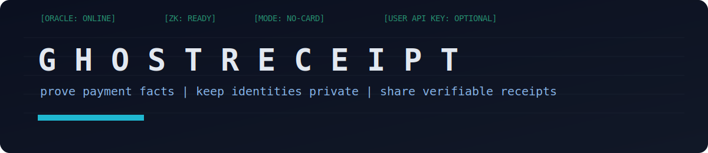
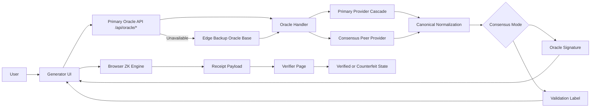
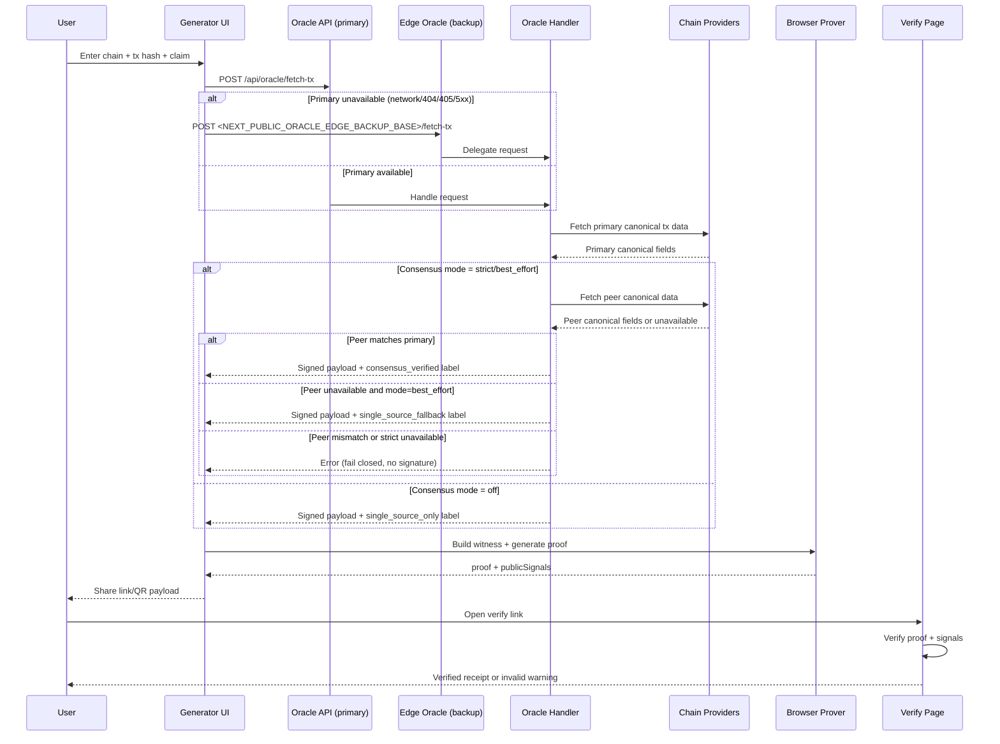

<!-- donation:eth:start -->
<div align="center">

## Support Development

If this project helps your work, support ongoing maintenance and new features.

**ETH Donation Wallet**  
`0x11282eE5726B3370c8B480e321b3B2aA13686582`

<a href="https://etherscan.io/address/0x11282eE5726B3370c8B480e321b3B2aA13686582">
  
</a>

_Scan the QR code or copy the wallet address above._

</div>
<!-- donation:eth:end -->


<div align="center">


[](https://github.com/Teycir/Ghostreceipt/actions/workflows/ci.yml)



**Generate cryptographic payment receipts without exposing sensitive on-chain identity data.**


### _"Prove the payment. Keep the privacy."_

Status:
- Release: `v0.1.0` (Live on Cloudflare Pages)
- Live demo: **[https://ghostreceipt.pages.dev](https://ghostreceipt.pages.dev)**


</div>

---

## Table of Contents
- [Overview](#overview)
- [The Problem GhostReceipt Solves](#the-problem-ghostreceipt-solves)
- [Key Features](#key-features)
- [Use Cases](#use-cases)
- [How Trust Works (Security Model)](#how-trust-works-security-model)
- [How It Works (Technical Details)](#how-it-works-technical-details)
- [FAQ](#faq)
- [For Developers](#for-developers)
- [Complementary Projects](#complementary-projects)
- [Contact](#contact)

## Overview

<div align="center">
  
</div>

**What is GhostReceipt?**

GhostReceipt lets you prove you made a cryptocurrency payment without revealing:
- Your wallet address
- The recipient's wallet address  
- The exact transaction ID

It uses **zero-knowledge proofs** - a cryptographic technique that lets you prove something is true without revealing the underlying data. 

You can share a cryptographic receipt that proves:
- ✅ You paid at least X amount
- ✅ The payment happened within a specific time window
- ❌ But hides your identity and the other party's identity

**Why use it?**
- Prove payment to clients without exposing your entire transaction history
- Show proof of funds without revealing your wallet balance
- Verify payments in disputes while maintaining privacy
- No signup required, no credit card needed, works in your browser

**How it works (simple version):**
1. Paste your transaction hash (the payment ID from blockchain)
2. Set your privacy preferences (minimum amount to prove, time window)
3. Generate a cryptographic proof in your browser
4. Share the proof link or QR code
5. Anyone can verify the proof without seeing your private details

## The Problem GhostReceipt Solves

**Current bad options for proving crypto payments:**

❌ **Option 1: Share your transaction link**  
Problem: Anyone can see your wallet address, trace all your other transactions, and see your balance.

❌ **Option 2: Send a screenshot**  
Problem: Screenshots can be easily faked. No way to verify it's real.

✅ **GhostReceipt's solution:**  
Generate a cryptographic proof that's mathematically verifiable but reveals only what you choose to share. It's like showing someone a sealed envelope that proves you have a $100 bill inside, without opening it.

## Key Features

**For Everyone:**
- 🚀 **Fast**: Generate proof in under 60 seconds
- 📊 **Measured average (integration test)**: `~181ms` end-to-end (`~171ms` proving) from `npm run test:perf:proof` (`measuredIterations=2`, `warmup=1`)
- 🔒 **Private**: Your wallet addresses stay hidden
- 📱 **Mobile-friendly**: Works on phones and tablets
- 🔗 **Easy sharing**: Get a link or QR code to share your proof
- ✅ **Verifiable**: Anyone can check the proof is real
- 🧭 **Trust clarity**: Validation-strength badges and inline explainers on generation and verification pages
- 🆓 **Free**: No signup, no credit card, no API keys needed

**Supported Cryptocurrencies:**
- Bitcoin (BTC)
- Ethereum (ETH)
- Solana (SOL)
- USDC on Ethereum

**Technical Features (for developers):**
- Zero-knowledge proofs generated in your browser
- Client-first oracle transport with optional edge backup failover
- Multi-provider data fetching with automatic backup
- Dual-source consensus validation for extra security
- Open source and self-hostable

## Use Cases
- Freelancers proving milestone payments without revealing wallet graph
- Merchants proving payment completion without exposing customer addresses
- Accounting and compliance teams validating payment evidence safely
- P2P market participants resolving disputes with verifiable receipts
- DAO contributors proving payouts while minimizing on-chain identity leakage

## Architecture (Technical Overview)

**Simple flow diagram:**

```
You → Enter transaction hash → GhostReceipt checks blockchain → 
Creates cryptographic proof in your browser → You share proof link → 
Anyone can verify it's real
```

<details>
<summary><b>Detailed technical architecture (click to expand)</b></summary>

**System architecture:**


**Sequence diagram:**



</details>

## API Model (Technical)

GhostReceipt uses multiple data sources to ensure reliability:

**Runtime route policy (fail-safe):**
- Primary route: `/api/oracle/*`
- Optional backup route: `<NEXT_PUBLIC_ORACLE_EDGE_BACKUP_BASE>/*` (recommended edge deployment)
- Backup is only used for transport/unavailable failures (network errors, `404/405`, or `5xx`)
- Backup is intentionally not used for normal client errors (`4xx`, including `429`) to avoid bypassing protections

**1. Public blockchain APIs (default, no keys needed):**
- Bitcoin: BlockCypher (with API token rotation) + mempool.space fallback
- Ethereum: Managed Etherscan keys + public RPC nodes
- Solana: Managed Helius keys + public RPC nodes

**2. Managed API keys (server-side):**
- Project maintainers provide API keys
- Multiple keys with automatic rotation for reliability
- Never exposed to users or client code

**3. Oracle API (internal):**
- Validates and signs transaction data
- Trust boundary between data providers and proof generation

**4. Optional user API keys (advanced only):**
- Users can add their own keys for higher throughput
- Never required for basic usage

## How It Works (Technical Details)

**For developers and technical users:**

### Step-by-step process:

1. **You provide:** Transaction hash + privacy preferences (minimum amount, time window)

2. **Data fetching:** GhostReceipt fetches transaction data from multiple blockchain data providers:
   - Bitcoin: BlockCypher + mempool.space
   - Ethereum: Etherscan + public RPC nodes
   - Solana: Helius + public RPC nodes

3. **Consensus validation:** The system cross-checks data from multiple sources to ensure accuracy

4. **Oracle signature:** Once verified, the system creates a cryptographic signature confirming the transaction facts

5. **Zero-knowledge proof:** Your browser generates a mathematical proof that:
   - Proves your payment meets your claimed criteria
   - Hides your wallet addresses and exact transaction details
   - Can be verified by anyone

6. **Share:** You get a link or QR code containing the proof

### Validation levels:

- **Consensus verified** ✅: Transaction confirmed by multiple independent data sources
- **Single source fallback** ⚠️: Primary source confirmed, backup source unavailable  
- **Single source only** ℹ️: Only one data source used

Default mode uses "best effort" consensus - tries to verify with multiple sources but doesn't fail if backups are unavailable.

## How Trust Works (Security Model)

**Simple explanation:**

When you generate a receipt, GhostReceipt:
1. Fetches your transaction data from the blockchain (using multiple sources to verify it's correct)
2. Creates a cryptographic signature confirming the transaction is real
3. Your browser generates a privacy-preserving proof
4. The proof can be verified by anyone, but only reveals what you chose to share

**What you're trusting:**
- The GhostReceipt service correctly fetches blockchain data (we use multiple sources and cross-check them)
- The cryptographic math works (it's based on well-tested zero-knowledge proof technology)

**What you're NOT trusting:**
- We never see your private keys or control your funds
- The proof generation happens in YOUR browser, not on our servers
- Your sensitive data (wallet addresses) never leaves your device

**For technical users:**

GhostReceipt uses multiple oracle signing keys with a transparency log for key rotation. Each transaction is verified against multiple blockchain data providers before signing. The oracle:
- ✅ Can confirm transaction facts (amount, timestamp, chain)
- ✅ Signs a commitment used for zero-knowledge proof generation
- ❌ Cannot forge blockchain state without compromising multiple data providers
- ❌ Cannot bypass cryptographic proof verification rules
- ❌ Never sees or stores your wallet addresses (proof generation is client-side)

Key management:
- Multiple oracle keys with rotation support
- Transparency log tracks all active and rotated keys
- Each signature includes a key ID for verification
- Full documentation: [docs/runbooks/SECURITY.md](./docs/runbooks/SECURITY.md)

## For Developers

### Quick Start

**Prerequisites:**
- Node.js 20.9.0 or higher
- npm 9.0.0 or higher

```bash
node --version  # Should be >= 20.9.0
npm --version   # Should be >= 9.0.0
```

**Installation:**

```bash
# 1) Clone the repository
git clone https://github.com/teycir/GhostReceipt.git
cd GhostReceipt

# 2) Install dependencies
npm install

# 3) Set up configuration
cp .env.example .env.local

# 4) Start development server
npm run dev
```

Open `http://localhost:3000` in your browser.

### Configuration Options

**Default setup (no configuration needed):**
- Works with free public blockchain data providers
- No API keys required
- No credit card needed

**Optional advanced configuration:**
- Add your own API keys for higher rate limits
- Configure consensus validation modes
- Customize provider endpoints
- Configure optional client failover backup route with `NEXT_PUBLIC_ORACLE_EDGE_BACKUP_BASE`
- For compact QR short links on Cloudflare Pages, bind D1 as `SHARE_POINTERS_DB` (see `docs/runbooks/CLOUDFLARE_PAGES_DEPLOYMENT.md`)

See `.env.example` for all available options.

### Tech Stack

**Frontend:**
- Next.js (App Router)
- React + TypeScript
- Tailwind CSS
- TanStack Query + React Hook Form

**Backend:**
- Next.js API routes
- Cloudflare Workers (optional)

**Cryptography:**
- Circom 2 (zero-knowledge circuits)
- snarkjs (proof generation)
- Ed25519 signatures

**Blockchain data:**
- Bitcoin: BlockCypher + mempool.space
- Ethereum: Etherscan + public RPC
- Solana: Helius + public RPC

### Documentation

**For users:**
- [How to use](https://ghostreceipt.pages.dev/docs/how-to-use.html)
- [FAQ](https://ghostreceipt.pages.dev/docs/faq.html)  
- [Security](https://ghostreceipt.pages.dev/docs/security.html)

**For developers:**
- [Documentation hub](./docs/README.md)
- [Deployment guide](./docs/DEPLOYMENT_READY.md)
- [Quick deploy](./docs/runbooks/QUICK_DEPLOY.md)
- [Cloudflare edge rate-limit runbook](./docs/runbooks/CLOUDFLARE_EDGE_RATE_LIMIT_RULES.md)
- [Oracle fail-safe architecture runbook](./docs/runbooks/ORACLE_FAILSAFE_ARCHITECTURE.md)
- [Manual testing runbook (step-by-step + live data)](./docs/runbooks/MANUAL_TESTING.md)
- [Fresh transaction test data table (amount + hash + time)](./docs/runbooks/FRESH_TRANSACTION_TEST_DATA_2026-03-26.md)
- [Security runbook](./docs/runbooks/SECURITY.md)
- [Changelog](./CHANGELOG.md)

**Technical deep-dives:**
- [Proof system decision](./docs/project/PROOF_SYSTEM_DECISION.md)
- [Threat model](./docs/runbooks/THREAT_MODEL.md)
- [Circuit self-review](./docs/runbooks/CIRCUIT_SELF_REVIEW.md)
- [Enhancement roadmap](./docs/project/ENHANCEMENT_ROADMAP.md)

## FAQ

### Do I need to connect my wallet?
**No.** You only need to paste the transaction hash (transaction ID). Your wallet stays disconnected and safe.

### Does GhostReceipt control my funds?
**No.** GhostReceipt never touches your cryptocurrency. It only reads public blockchain data to verify transactions happened.

### Do I need to sign up or pay?
**No.** No account needed, no credit card required. Just visit the website and start generating proofs.

### What information does the proof reveal?
**Only what you choose:**
- ✅ That a payment of at least X amount occurred
- ✅ That it happened within a time window you specify
- ❌ NOT your wallet address
- ❌ NOT the recipient's wallet address
- ❌ NOT the exact transaction ID

### Can someone fake a proof?
**No.** The proofs use cryptographic math that's impossible to fake. Anyone verifying your proof can be certain it's legitimate.

### What does "consensus verified" mean?
**It's a trust indicator.** When you see this label, it means:
- ✅ **Consensus verified**: Transaction data was checked against multiple independent sources and they all agreed
- ⚠️ **Single source fallback**: One verification source was unavailable, but the primary source confirmed the transaction
- ℹ️ **Single source only**: Only one data source was used (less verification)

### Which cryptocurrencies work?
- Bitcoin (BTC)
- Ethereum (ETH)  
- Solana (SOL)
- USDC on Ethereum

### What if I send Bitcoin to multiple recipients in one transaction?
**Important:** For Bitcoin, the proof shows the total amount sent in the transaction, not what each individual recipient received. If you sent to multiple people, the amount shown is the sum of all outputs.

### Is my data stored anywhere?
**No.** The proof generation happens entirely in your browser. Your wallet addresses and transaction details are never sent to any server.

### Can I use this for business/legal purposes?
**Maybe.** GhostReceipt provides cryptographic proof of payment, but whether it's accepted for legal/business purposes depends on the other party. It's best used for situations where both parties agree to use privacy-preserving proofs.

## Complementary Projects

GhostReceipt is part of a privacy-first toolkit. Check out these related projects:

### [GhostChat](https://github.com/Teycir/GhostChat) | [Live Demo](https://ghost-chat.pages.dev)
**True peer-to-peer encrypted messaging with zero server storage**
- WebRTC-based P2P chat where messages travel directly between users
- Self-destructing messages (5s, 30s, 1m, 5m timers)
- Memory-only storage with no disk traces
- Connection fingerprint verification to detect MITM attacks
- Perfect for: Sharing payment receipt links securely without leaving traces

**Use with GhostReceipt**: Share your generated receipt links via GhostChat to ensure the communication channel itself is private and ephemeral.

### [TimeSeal](https://github.com/Teycir/Timeseal) | [Live Demo](https://timeseal.online)
**Cryptographic time-locked vault and dead man's switch**
- Send encrypted messages/files that unlock at a specific future date
- Dead man's switch mode: auto-unlock if you stop checking in
- Split-key architecture with server-enforced time locks
- 30-day retention with grace period for recovery
- Perfect for: Time-delayed payment proof disclosure or conditional receipt sharing

**Use with GhostReceipt**: Seal a payment receipt that only unlocks after a milestone date, or set up a dead man's switch to auto-release payment evidence if you go silent.

### [Sanctum](https://github.com/Teycir/Sanctum) | [Live Demo](https://sanctumvault.online)
**Zero-trust encrypted vault with plausible deniability**
- Duress-proof hidden layers (decoy/hidden/panic passphrases)
- XChaCha20-Poly1305 encryption with IPFS storage
- RAM-only key storage immune to forensic recovery
- Perfect for: Storing sensitive payment receipts with cryptographic deniability under coercion

**Use with GhostReceipt**: Store your generated receipt links and verification keys in Sanctum's hidden layer, protected by plausible deniability if device is seized.

### [HoneypotScan](https://github.com/Teycir/honeypotscan) | [Live Demo](https://honeypotscan.pages.dev)
**Smart contract honeypot detector for DeFi safety**
- Detects scam tokens that prevent selling after purchase
- 13 specialized patterns across Ethereum, Polygon, Arbitrum
- 98% sensitivity with 95%+ cache hit rate
- Perfect for: Verifying token legitimacy before generating payment receipts for crypto transactions

**Use with GhostReceipt**: Before proving payment for a token purchase, verify the token isn't a honeypot scam that would make your receipt meaningless.

---

## References
- Product and execution roadmap: [docs/project/ENHANCEMENT_ROADMAP.md](./docs/project/ENHANCEMENT_ROADMAP.md)
- Reference source: [xmrproof](https://github.com/Teycir/xmrproof)
- Reference source: [Timeseal](https://github.com/Teycir/Timeseal)
- Reference source: [Sanctum](https://github.com/Teycir/Sanctum)
- Reference source: [smartcontractpatternfinder](https://github.com/Teycir/smartcontractpatternfinder)

## Contact
- Creator: [Teycir Ben Soltane](https://teycirbensoltane.tn)
- Issues: `https://github.com/teycir/GhostReceipt/issues`
- Security inquiries: open a private issue with `[SECURITY]` in title
